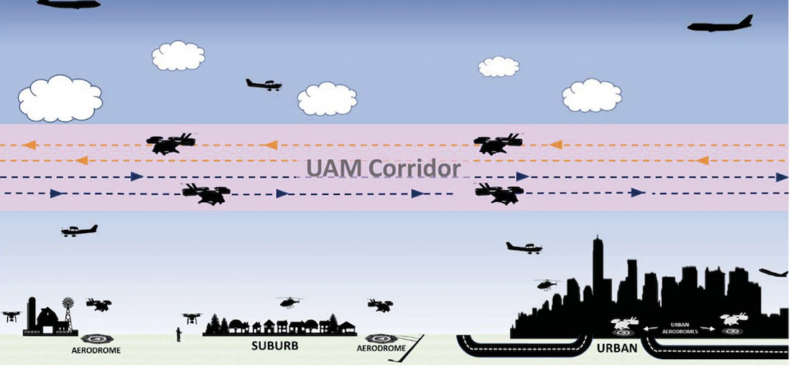
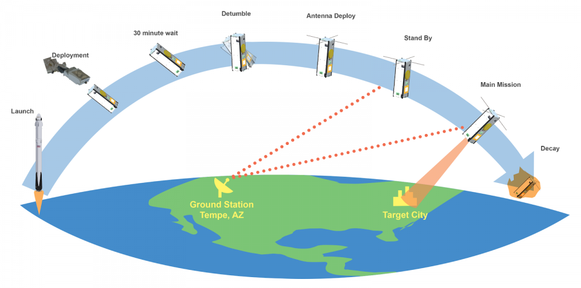
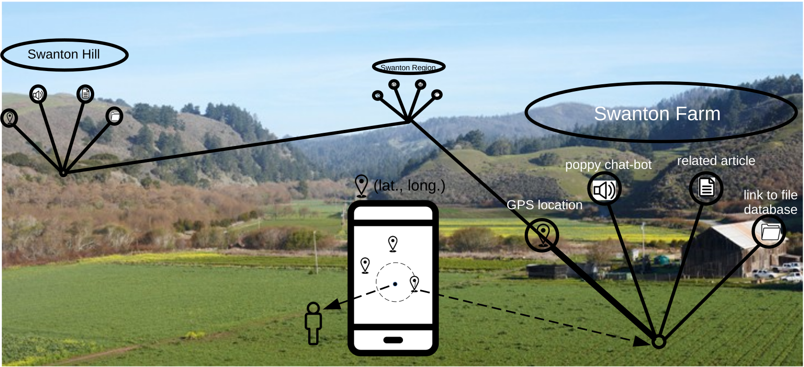
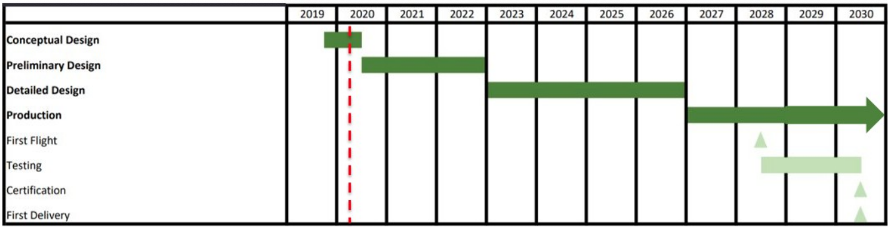
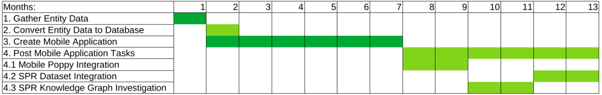

# A Study of System Design
## An Application to the Swanton Pacific Ranch
**Justin Wheeler  
CSC 570  
Cal Poly San Luis Obispo, Computer Science and Software Engineering Department ** 

### Abstract
Systems engineering is a necessary aspect to any large program or project. In industry, we see the principles of systems engineering used most frequently in military and defense where systems and projects tend to be very large and span across many engineering disciplines. The purpose of this investigation is to demonstrate the use of system design and systems engineering techniques to the Swanton Pacific Ranch Project and explain their significance. Through using system design/engineering techniques, I produce for my client, the Swanton Pacific Ranch (SPR), a system with a holistic view in mind. I am able to better define the problem and solutions available to my client, create a project timeline that can be followed several years from project start, and provide a predefined framework that students can utilize for easy project integration further along in the project.  

### Introduction
Let us suppose that we would like to build an airplane, or an automobile. Where do we start? Much can be said about the organization of such projects, but for now let us start somewhere. For a car, do we start with the frame, the body, or the powertrain? How many people do we need to design and build such pieces? We surely can't do all the work ourselves. What kind of knowledge do these individuals need to possess. For the powertrain, or engine, you may need a number of different skill-sets. What specific fuel octane will be optimal given the current design? We may need a chemist. How are we to manufacture it? We may need a manufacturing engineer skilled in metal casting. How will we design it? We may need a mechanical engineer to draw up the CAD. When can we expect to have the project finished, and how much is it going to cost? What does this mean for us if the team is working for a company? What if the team works for the government? These types of questions depict the necessity, responsibilities, and purposes of systems engineering. 

### Background
#### Systems Engineering and System Design
Systems Engineering is defined as an interdisciplinary field of engineering and engineering management that focuses on how to design, integrate, and manage complex systems over their life cycles. According to [1], A systems engineer captures user needs and defines a feasible system design to meet all system requirements and constraints. Systems engineering is a top-down, macro approach to engineering. A systems engineer does not to get too specific but operates in a mode just specific enough to most effectively guide a project to completion or provide the best framework for others to make meaningful contributions to the same project.   

System design is defined as the process of defining the architecture, modules, interfaces, and data for a system to satisfy specified design requirements. According to [1], "Although the system designer’s tasks represent only 5-10% of total project effort, their adequacy, accuracy, and timelines are critical to the success of complementary activities." A system designer is responsible for not just the technical aspects of a system but the financial feasibility, customer needs, and sometimes even defining the problem themselves.  

#### Computer Based Systems Engineering
A computer-based system (CBS) is defined as a physical system such as a vehicle or medical device which uses some internal computational processing system to carry out a specific function [1]. The term computer-based system includes both the physical encompassing system and the electronic computation system. In essence, this is akin to the discipline of embedded systems. According to [1], computer-based systems engineers are especially important because there are few systems engineers in the workplace (at the time the document was written) that have enough familiarity in the fields of communications, hardware, and/or software to intelligently and correctly apply systems engineering/design techniques to real-world computer-based systems.  

The authors attribute this to several reasons. The traditional fields of systems engineering include Aerospace, Mechanical, and other large project type engineering disciplines. As a result, systems engineers are often not taught in school the necessary skills for adequately understanding and applying knowledge of electronics, software, and hardware to computer-based systems. Furthermore, the traditional fields of Aerospace and/or Mechanical or even Managerial Engineering differ from those of the electronic fields in some stark ways. The rate of innovation in the fields of computer engineering and computer science starkly outperforms that of any other field. The model architectures and potential for reusability in the computation fields are very unfamiliar to traditional systems engineers. Traditional systems engineers do not understand the value of tools such as state machines or common code libraries because the same data structures and extent for reusability are not found in other engineering disciplines. It is important for a systems engineer to be well versed in the computational sciences when working on computer-based systems.  

A computer-based systems engineer alleviates these weaknesses. By having a traditional systems engineer and a computer-based systems engineer working together, both the computational and physical systems may have systems engineers leading their particular areas of expertise at the project level. This leads to overall better system design and less confusion amongst team members.  

### An Application to the Swanton Pacific Ranch
This section will follow the systems engineering process that I followed in executing my tasks for the Swanton Pacific Ranch (SPR). I will introduce particular documents and/or concepts, explain their value/purpose, and explain how I implemented them in my work for the SPR.  

#### Concept of Operations
According to this standard [2], a concept of operations (ConOps) is a user-oriented document that describes system characteristics for a proposed system from the user's viewpoint. The ConOps document is used to communicate overall quantitative and qualitative system characteristics to the user, buyer, developer, and other organizational elements. It is used to describe the user's organization, missions, and organizational objectives from an integrated systems point of view.

The exact structure of a ConOps is determined by its main objective and can come in different forms depending on the project or organization. Here are a few examples of some real ConOps diagrams. The first from the FAA is an illustration of new Urban Air Mobility (UAM) corridors [4]. Now that electric vertical takeoff and landing (eVTOL) aircraft are becoming a reality, the FAA is essentially proposing traffic lanes in the sky to be reserved specifically for these aircraft. This ConOps was created with the purpose of illustrating the concept of the UAM corridor as an impending potential regulation to the Aerospace industry. As such, it shows many important pieces of information to the viewer. It shows the aerodromes where the eVTOL aircraft will takeoff and land. It shows these aerodromes in the three types of locations: rural, suburban, and urban. It shows how the UAM will function in a shared airspace, among various other types of aircraft, from the small RC quadcopters on the bottom to the large Boeing 737 on top. This ConOps was effective at achieving its purpose: showing what the new regulation would look like and how it would integrate with other systems already in place.

{ width=600 }
FAA UAM [4]

Here is another example from the Arizona State University cubesat club. The purpose of this ConOps is to show the mission and operational steps associated with the specific cubesat satellite. As you can see from the picture, the satellites operational steps are clearly depicted from launch to finish. This is another effective use of a concept of operations document.  

{ width=600 }
ASU CubeSat [5]

For my SPR team project, I created a ConOps document shown below. The purpose behind this document is as follows. After understanding the problem given to me by the SPR staff, I came up with a solution. The solution was a system with many components. In order to convey this system to the SPR staff, we know that a picture is worth a thousand words. My solution was a Pokemon Go-like application. So, in this concept of operations, I show the end-user in the center of the illustration and a diagram representing the end-user's smart phone running the proposed mobile application. The necessary data structures are represented by the groups of entities in black. From the staff's point of view, it is conveyed that each entity or location has a name, gps location, description (inferred), articles, etc. associated with it. The chatbot circle represents integration with the poppy chatbot that the SPR staff have been working on on the side. The link to file database circle represents integration to the 16 SPR datasets which have yet to be organized. The SPR staff can deduce from this illustration that their virtual tour guide application will represent each important feature of the ranch via gps pins on a smart phone. The concept of operations document is indispensable in clearly conveying plans for such a project. For me, this document helped explain my ideas to my client, the SPR staff, clearly and ensure clear communication and shared understanding of the problem and solution.

Furthermore, this document, as a valid ConOps, serves as a system level diagram for anyone working on the SPR project. When people much further along in the project begin making decisions, this document serves as a helpful reference point as an illustration of what the system should look like at the conceptual level.

{ width=600 }

#### System Requirements
The Requirements Specification is another very important document. The system requirements essentially define the system. They tell the user when they have a working implementation of the system. Every task in the statement of work in the following section should be traceable back to some system requirement. Any task that is not at least in some way directly or indirectly related to a system requirement should be considered unnecessary, for it does not contribute to the system as defined by the system requirements document. If a task is without justification, it is wasted work (going down a rabbit hole if you will). Please see Appendix entry "Sample Requirements" to see some sample requirements for the SPR project.

In the statement of work document, all tasks should be traceable to at least one of the design requirements in the Requirements Specification. Design requirements define the system and define when the system shall be considered complete. In the statement of work, each task should be labeled with its corresponding system requirement. I have not done this to save time. This is also a smaller scale project for which the task relevance should be obvious. Nonetheless, when the system stores all important entity data (1.), implements a mobile application (2.), and integrates the other SPR tools (3.), and thereby satisfies all design requirements, the system shall be considered complete.

#### Statement of Work
A statement of work as defined by [6] is "a narrative description of the products and services to be supplied to a client, as well as a description of the contractor's needs and requirements to properly perform the delivery of such products and services under contract." In other words, a statement of work simply identifies the responsibilities of all parties involved in a project. The statement of work establishes the baseline or foundation upon which the services and products within a company or project are to be delivered.

For the Swanton Pacific Ranch project, I created the Statement of Work document from the perspective of the design team of an engineering system. This statement of work simply looks like a large list of tasks. We don't have to worry about complex stakeholder, customer, or company relationships. Each particular task in the statement of work has its own description (and requirements) and can be contracted out or done in house (by SPR personnel). Anyone working on the project, whether a contractor, a student, or staff, can simply trace their current objectives back to this statement of work and understand exactly what is required of them. It is the "solid foundation" alluded to in [6]. Each task group or subsystem should have its own requirements specification or design requirements; however, due to the lack of specificity inherent to this project and its smaller scale, I found it superfluous to include these in the document. Please see Appendix entry "Excerpt from Statement of Work" for an excerpt from the SPR virtual tour assistant's statement of work.

As you can see from the statement of work's initial hierarchical task list, the hierarchy progresses from task groups to the specific required tasks themselves, from macro to micro. Each task has its own entry further down in the document with detailed descriptions. Each task group has its expected time, expected working personnel, and expected tools associated with it. This should be ideal documentation for a staffer who is unfamiliar with the technical work needing to be done on the project. It should give a staffer adequate information for finding appropriate personnel for working on the project. Each individual task has its own expected time to completion. It is these time allotments that allow system planners to make time estimates on program schedules.

#### Program Schedule
A program schedule is a listing of a project's milestones, activities, and deliverables, usually with intended start and finish dates. These items are often coupled with some form of a work breakdown structure, like a statement of work. One of the most famous representations of the program schedule is the Gantt chart. The Gantt chart, named after its inventor, Henry Gantt, is characterized by horizontal bars that span across the chart's body representing durations of time. In a program schedule these horizontal bars correspond to specific tasks in a work schedule. [3] The width of these horizontal bars reflect the planned duration of each task while their color or opacity may reflect the status of a particular task. Here is an example of a Gantt Chart for a previous aircraft design project:  

{ width=600 }

As you can see from this chart, the four major phases, conceptual design, preliminary design, detailed design, and production are all laid out with their respective timelines. Project milestones are listed right below them. The red line depicts the particular place in time when the illustration was shown. From this program schedule, one can clearly see where the project's particular current place in time relates to the milestones of the greater project. This chart shows the entire design & production timeline, so there is no integration to the program's immediate work schedule and task lists.

For the SPR project, I created a program schedule in Excel. The project overview chart is shown below:

{ width=600 }

This chart is not as specific as other program schedules, for the project for which I was designing for has not the same organizational structure or risk as, for example, designing an airplane. The environment for which the chart was created is very informal. The SPR staffers do not know who will take on each task. Nor do they know necessarily when each task later in the project will be started. So, it makes sense that this program schedule remain time inspecific. The most important parts of this document are the relative time durations of particular tasks and the relative order that they are in. If needed, a SPR staffer may easily substitute the column headers with the correct month abbreviations upon necessity to make the project schedule time specific.

This Gantt chart integrates with the work schedule, or statement of work, described in the section above. The chart shown is a simplified overview of the project design phase, so the contents in the first column correspond directly to task groups in the program work schedule. One can trace the numbers to the left of the task names to the exact tasks assigned in the statement of work document.

### Conclusion
System design and systems engineering are crucial aspects to any engineering project, to the project's cohesion, its progression, and its completion. Though we see the principles of system design and engineering used most in the more traditional fields of aerospace and mechanical engineering, through this paper, we have seen these principles applied to a software-based system. In doing so, I have created several documents, laying out future work for the SPR virtual tour assistant system that, if followed, should guarantee the successful creation of such system within the next few years. The concept of operations shows what the system looks like. The requirements specification defines the system. The statement of work lays out the work for the system. And, the program schedule relates the project's tasks to our human perspective of time. These documents and further applications of system design/engineering principles should enable the Swanton Pacific Ranch staff to successfully create and integrate a virtual tour assistant.

### References

[1] S. White et al., “Systems engineering of computer-based systems,” in Fems Immunology and Medical Microbiology - FEMS IMMUNOL MED MICROBIOL, 1994, vol. 26, pp. 18–29, doi: 10.1109/ECBS.1994.331687.  
[2] "IEEE Guide for Information Technology - System Definition - Concept of Operations (ConOps) Document," IEEE Std 1362-1998, pp. 1–24, 1998, doi: 10.1109/IEEESTD.1998.89424.  
[3] "Scheduling Guide for Program Managers" (PDF). AcqNotes.com. Defense Systems Management College Press. 2001. Retrieved 21 Feb 2021.  
[4] "Concept of Operations for Urban Air Mobility," nasa.gov. FAA. 2019.  
[5] "Concept of Operations," Phoenix CubeSat. [Online]. Available: http://phxcubesat.asu.edu/ConOps. [Accessed: 21-Feb-2021].   
[6] Martin, M. G. (1998). "Statement of work: the foundation for delivering successful service projects," PM Network, 12(10), 54–57.  

### Appendix

#### Sample Requiremnts
1. Shall store all entity data  
    1.1 Shall include list of all important entities  
    1.2 Shall include all attributes: EntityExample.txt  
    1.3 Shall store entities data as database file, ex. "json"  
2. Shall implement mobile application  
    2.1 Shall read in database file and relevant pictures/articles  
    2.2 Shall implement Google/Apple maps  
    2.3 Shall track user’s location and relate to entity locations  
    2.4 Shall act as virtual tour guide  
        2.4.1 Shall display name, description, pictures, articles at minimum  
    2.5 Base functionality shall work completely offline (excluding Poppy [SOW 6.], SPR Database [SOW 7.]).  
3. Shall integrate other SPR projects  
    3.1 Shall integrate Poppy (late implementation)  
    3.2 Shall integrate SPR Database (late implementation)  

#### Excerpt from Statement of Work
1. Gather Entity Data  
    1.1 Define most important entities  
    1.2 Preliminary Data Gathering  
    1.3 Secondary Data Gathering  
    1.4 Entity Data Linking  
        1.4.1 Related Entities  
        1.4.2 Database  

1. Gather Entity Data  
Expected Length: 1-3 months  
Expected Working Personnel: Jeanine (or other SPR staff)  
Minimum Necessary Tools: Excel  
Description: This task group involves gathering a list of all the important entities on the Swanton Pacific Ranch that the SPR staff would like to see appear and described on the virtual tour guide application. These tasks may be done incrementally or repeatedly as more entities are added to the entity database. Recommend: alter ‘EntityList.csv’ using Excel. Continue to save to ‘.csv’ for easy future code integration.

1.1 Define most important entities  
Expected Length: 1 week  
Description: Create a list of the most important entities on the Swanton Pacific Ranch. Add to csv file.

1.2 Preliminary Data Gathering  
Expected Length: 1-2 weeks  
Description: For each entity in [1.1], record name, gps-location, and a short-description in csv file.

1.3 Secondary Data Gathering  
Expected Length: 2-4 weeks  
Description: Retrieve and/or write articles/pictures pertaining to selected entities and place in respective columns. Place corresponding articles/pictures in correct folder. Add filenames in corresponding single cells in following format: [article1.html, article2.html, …] and [pic1.png, pic2.jpg, ...]. 

